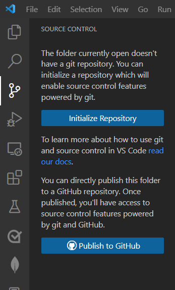

# Docs Contribution
:::info Note 1
This page is still a work-in-progress.
:::
:::info Note 2
Pull requests for the documentation will not be reviewed until we finish all the important documentation.
:::
:::info Note 3
The installation steps here apply to Windows (Non-N), GNU/Linux with a Desktop Environment, and macOS.
:::
This page will cover all the necessary information for contributing to this wiki.

## Guidelines
1. Use proper grammar and punctuation. If you have trouble with that then maybe you're not up for contributing to the wiki. We try to keep these pages well-written.
2. Do not make any redundant changes to the content on these pages. You may solve any punctuation, grammar, or formatting errors, but do not swap synonyms or make sentences longer if they don't have to be.
3. Do not make any unnecessary changed to the docs. You may only change/add stuff within the `SynthLauncherDocs/docs` folder. Do not make any changes to the configuration files or folders which contain crucial 
elements.
4. If you're making a new page, make sure to organize sections of your writing within subsections, which you can do by adding `##` or `###` before a heading.
5. Do not provide any misinformation; this goes without saying.

## Section 1: Basic Requirements
This section will cover the prerequisites needed to contribute to the docs.

:::info
This section will cover:

**GitHub:** The platform that hosts the files and website for the documentation.\
**Visual Studio Code:** A code editor that supports Git and GitHub integration\
**Git:** A simple command line tool used to push your changes to the cloud.\
**node.js (with Docker & npm):** A JavaScript runtime environment to run Docusaurus in your terminal.\
**Docusaurus:** The static site generator used by the wiki.

Skip this section if you already have these programs.
:::

### GitHub
Firstly, you'll need to create an account on GitHub. This is where the repository is based. \
Head over to https://github.com/ and create an account, then you need to **fork** the repository. The repository is located [here.](https://github.com/SynthLauncher/SynthLauncherDocs)

To fork it, click on the Fork button at the top right of the screen, as shown in the below image.


Now, navigate to your fork. It should named ***your username**/SynthLauncherDocs*
That's it for this section.

### Visual Studio Code
You'll need a code editor that supports Git. We recommend Visual Studio Code for its effortless GitHub and Git integration. 
The official source to get it is [here.](https://code.visualstudio.com/)\
After you install it, login to Code with your GitHub account; you will be asked to install 
the Github plugin, click yes. Next, you must clone the fork you made onto your computer.\
Navigate to the **Source Control** page and select the **Initialize Repository** button on that page.



After you have gotten the Docs repo setup, your sidebar will appear as such:


This is where all the components of the wiki is located in. You'll only need to work with the `docs` folder.

### Git
Now, you'll install Git so you can easily manage your work.\
Get it from https://git-scm.com/downloads/ \
Follow the installation procedure as you'd usually do with any other program.\
This installs Git Bash, which is a terminal environment.

### node.js
Navigate to https://nodejs.org/en/download \
Choose the latest LTS version, which is 22.17.0 as of now, for your operating system, using **Docker** with **npm**.\
Follow the installation procedure; you'll be asked to install additional components, which you should do.

### Docusaurus
This is the final program you'll need to install. \
You simply have to run `npm install -g pnpm@latest-10`, followed by `pnpm install`.\
To start the docs for live changes, run `pnpm run start`.

## Section 2: Writing Docs
The Wiki uses **Markdown**, a lightweight markup language.\
There are many resources online to get you started with it such as [this one.](https://www.markdownguide.org/cheat-sheet/)

### If you're making a new document:
Firstly make a file within a suitable folder. Make sure the file name only includes ASCII characters; and is fully lowercase, with no spaces, you may used dashes (`-`) instead. \
The file name extension must be `.mdx`

For example, this page is located under the Contributions folder.\
The file name is `docs.mdx`. 

The first 3 lines must be;
```
---
title: <your title>
---
```
You can now do what you want after this point; but remember to follow the [Guidelines](#guidelines) we mentioned.

### If you're editing a current document:

Just make sure to follow the guidelines :)
 