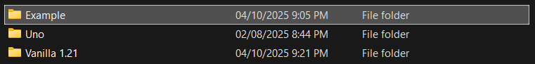
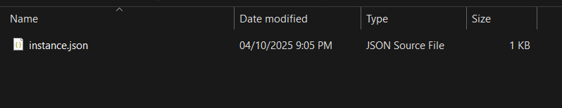

:::danger
Only install mods from trusted sources otherwise they may cause harm to your computer. We recommend using well-known sites 
such as [Modrinth](https://modrinth.com) or [CurseForge.](https://www.curseforge.com/minecraft) But you should still take caution for 
less popular mods. 

Mods (at least for Java Edition) will always come in a `.jar` format. 
:::

# Installing Fabric

## Installation through SynthLauncher
1. Open SynthLauncher
2. Go to the Instances tab on the sidebar
3. Create a new instance and choose "Fabric" under the **Mod Loader** dropdown. Give it any **Instance Name** you like and the **Minecraft Version** you want to play but 
note the version down. 
:::note
The mods you plan on installing will only work if they are made for that version of Minecraft. For example, if your Minecraft version is 1.16.5, you are only able to run mods made for that version.
:::
4. Download the mod(s) onto your computer.
5. Open your new modded instace and click on the little folder icon on the right side.

6. This will open a window in your file navigator which will show your instance(s) on SynthLauncher. 
\
Click on the one that shares the same name as the instance you wish to modify. You will see **at least** an `instance.json` file located there.

7. You will now have to create a folder within your instance's folder to put your mods in. This folder should simply be called `mods`. You cannot choose any name other than 
that if you want your mods to work. If you've launched this instance before, it might already exist.
8. **Drag and drop** or **cut & paste** the mods you downloaded into the `mods` folder.
9. Launch your instance from SynthLauncher. If you've followed these steps correctly, it should work.